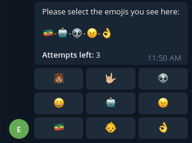

[![Forks][forks-shield]][forks-url]
[![Stargazers][stars-shield]][stars-url]
[![Issues][issues-shield]][issues-url]
[![MIT License][license-shield]][license-url]


<br />
<p align="center">  
  <br/>
  <h1 align="center">🛡️ Emoji Captcha Bot for Telegram</h1>
  <p align="center">
    Protect telegram groups from automated bots (spams, scams, adults, etc..)
    <br />
    <br />
    <a href="https://github.com/TibebeJS/emoji-captcha-bot/issues">Report Bug</a>
    ·
    <a href="https://github.com/TibebeJS/emoji-captcha-bot/issues">Request Feature</a>
  </p>
  <br/>
  <br/>
</p>

## Motivation
With Telegram increasingly getting popular and popular social media option in recent years, it has become a target for s(p/c)ammers. Many groups and their members are bombarded by spam and unsolicited messages on daily basis, mostly attributed to the lack of built-in protections systems in place.

This project intends to mitigate these issues by forcing every new member to go through a captcha verification process thus making it harder for automated accounts/userbots to roam free in these groups.

## Getting Started

Git clone the repo:
```bash
git clone https://github.com/TibebeJS/emoji-captcha-bot.git
```

Change directory into the newly created repository ("emoji-captcha-bot")
```console
cd emoji-captcha-bot.git
```

Install dependencies
```console
npm i
```

Create `.env` file (a sample content is provided in `.env.sample`)

Example:
```console
echo "BOT_TOKEN=123456:bottoken" > .env
```

Run the project
```console
npm start
```

## How it works

### **Version 1 (Current):**
- Whenever a new member joins a group they will automatically be muted/restricted by the bot.
- Bot then sends a message which contains emojis (presented as text).
- User is prompted with emoji buttons to click on.
- if user successfully manages to select all the emojis that are present in the challenge, his/her restrictions will be lifted automatically by the bot.
- if the user runs out of attempts left before completing the challenge, he/she will remain restricted. 

Sample challenge:




## Features:
- [x] Text emojis challenge
- [x] Attempts counter
- [ ] Restrict/Unrestrict after challenge
- [ ] Scrambled Image challenge (instead of just text)
- [ ] Audio challenge
- [ ] Timeouts

## Contribution:

#### Feel free to fork, edit and send a PR.
---
<br/>

> Note this project is **still a WIP :)**
>
> More detailed documentation & features coming up. stay tuned.

[forks-shield]: https://img.shields.io/github/forks/TibebeJS/emoji-captcha-bot.svg?style=for-the-badge
[forks-url]: https://github.com/TibebeJS/emoji-captcha-bot/network/members

[stars-shield]: https://img.shields.io/github/stars/TibebeJS/emoji-captcha-bot.svg?style=for-the-badge
[stars-url]: https://github.com/TibebeJS/emoji-captcha-bot/stargazers

[issues-shield]: https://img.shields.io/github/issues/TibebeJS/emoji-captcha-bot.svg?style=for-the-badge
[issues-url]: https://github.com/TibebeJS/emoji-captcha-bot/issues

[license-shield]: https://img.shields.io/github/license/TibebeJS/emoji-captcha-bot.svg?style=for-the-badge
[license-url]: https://github.com/TibebeJS/emoji-captcha-bot/blob/main/LICENSE
